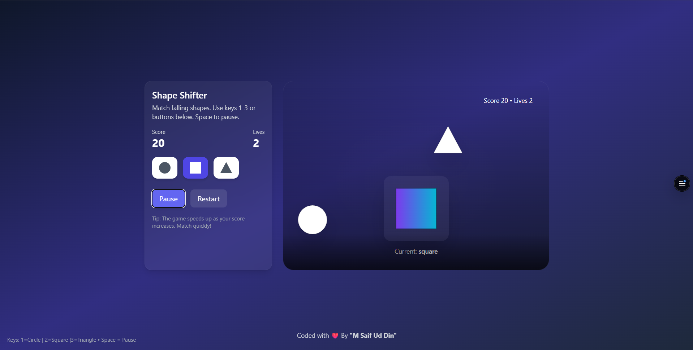

# 🔵⏹️🔼 Shape Shifter



**Shape Shifter** is a fast-paced, interactive web game built with React. The objective is simple but addictive: match your player's shape to the falling shapes before they collide! As your score increases, the shapes fall faster, testing your reflexes and quick thinking.

---

## 🚀 Live Demo

[Play Shape Shifter Here](https://shape-shifter-game.vercel.app/)

---

## ✨ Features

* **Dynamic Gameplay:** Game speed progressively increases based on your score, keeping the challenge fresh.
* **Keyboard & UI Controls:** Play using intuitive on-screen buttons or quick keyboard shortcuts (`1` for Circle, `2` for Square, `3` for Triangle, `Space` for Pause).
* **Smooth Animations:** Fluid shape-shifting and collision animations powered by Framer Motion.
* **Modern UI:** A beautiful, responsive, glassmorphism-inspired interface styled with Tailwind CSS.
* **Score & Lives Tracking:** Real-time HUD tracking your progress and remaining chances.

---

## 🛠️ Tech Stack

This project was built utilizing modern front-end technologies:

* **Framework:** [React.js](https://reactjs.org/) (Functional Components, Hooks)
* **Styling:** [Tailwind CSS](https://tailwindcss.com/)
* **Animations:** [Framer Motion](https://www.framer.com/motion/)
* **Deployment:** [Vercel](https://vercel.com/)

---

## 🎮 How to Play

1.  Hit **Start** to begin the game.
2.  Watch the shapes falling from the top of the screen.
3.  Change your player's shape at the bottom to match the falling shape before it hits you.
4.  **Match successfully:** Gain +10 points!
5.  **Mismatch:** Lose 1 life. 
6.  The game ends when your 3 lives run out. 

---

## 💻 Local Installation

If you want to run this project locally on your machine, follow these steps:

1. **Clone the repository:**
```bash
   git clone [https://github.com/MSaifUdDin-999/Shape-Shifter-Game.git](https://github.com/MSaifUdDin-999/Shape-Shifter-Game.git)

```

2. **Navigate to the project directory:**
```bash
cd shape-shifter

```


3. **Install dependencies:**
```bash
npm install

```


4. **Start the development server:**
```bash
npm run dev
# or npm start (depending on your setup)

```


5. **Open in Browser:**
Visit `http://localhost:3000` or `http://localhost:5173` to view the application.

---

## 👨‍💻 Author

I'm **M Saif Ud Din**, a Full-stack developer passionate about building clean, responsive, and real-world web applications while continuously exploring modern technologies.

Linkedin : **https://www.linkedin.com/in/muhammad-saif-ud-din-0b604840b/**

GitHub : **https://github.com/MSaifUdDin-999**

Email : **mrsaif1166@gmail.com**

If you enjoyed this project:

- ⭐ Star this repository
- 🍴 Fork it and build something awesome
- 💬 Share your feedback or suggestions

Happy Coding! 🚀

---

*Developed with ❤️ by M SAIF UD DIN*
